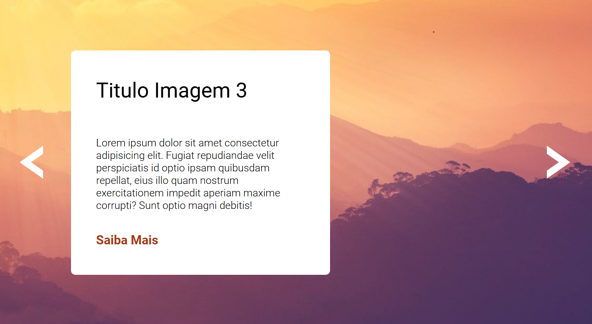
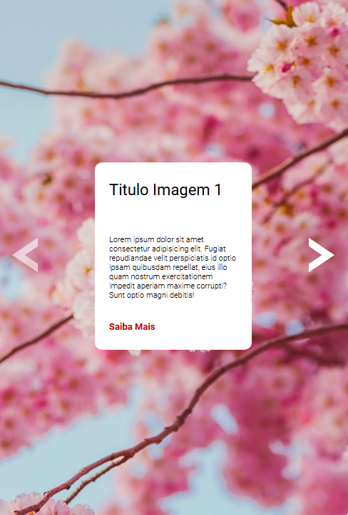

# Slider | Carroussel de Imagens

## Descrição

Projeto criado para fixação de conceitos aprendidos no módulo intermediário de JS do Dev Quest - FrontEnd!

## Conceitos trabalhados e fixados no projeto:

* Estrutura de pastas padrão no projeto; ✅
* HTML Semântico; ✅
* Display Flex; ✅
* Responsividade; ✅
* Aplicação de imagens de fundo; ✅
* Navegação pela página com setas interativas; ✅
* Uso de funções; DOM e eventos no JS ✅

## Design Desktop

    

## Design Mobile

    

